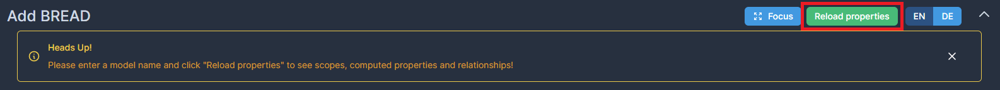
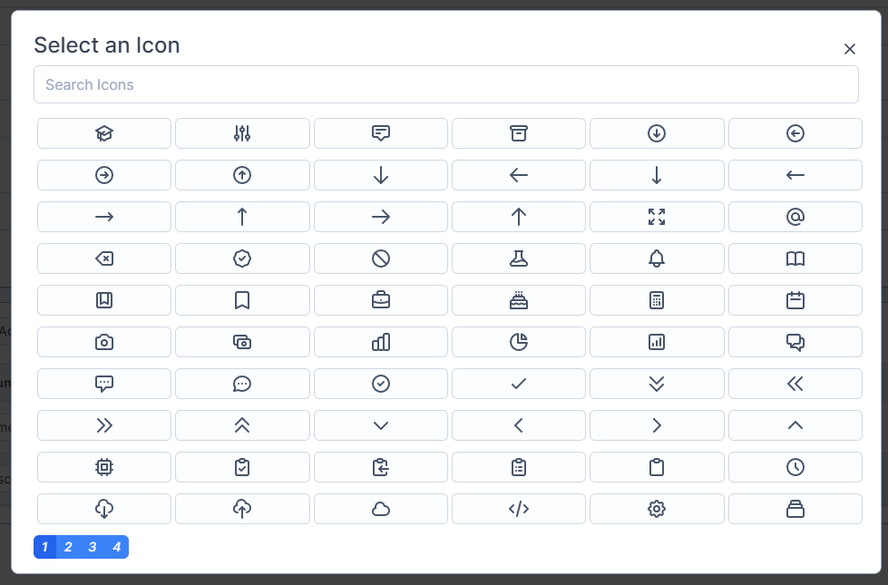
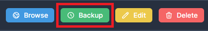
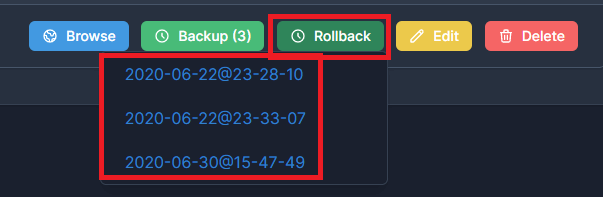
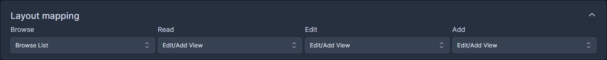

# BREAD Builder

The BREAD builder is the heart of Voyager.  
This page will walk you through 

## Model

When adding a BREAD, you have to provide a fully qualified model name.  
After that, you'll have to click `Reload properties`.  
This will then load all fields from your model, accessors, scopes and relationships.

 

## Icon

Clicking this button opens a modal showing you all icons which you can use for your BREAD.  
Double-click the icon you want to use and the modal will close.  
This icon is shown in your BREAD and in the menu.

 

## Global search field

The global search field is the field which is shown in the search for this BREAD.  
For a users BREAD you might want to display the name for example.  
Select `None` to exclude this BREAD from the global search.

## Storage path

By default, BREADs are stored under `storage/voyager/breads`.  
You can change this behaviour by calling `setPath` on the BREAD manager in your Service Provider:

```php
use Voyager\Admin\Manager\Breads as BreadManager;

public function boot(BreadManager $breadmanager)
{
    $breadmanager->setPath('your/new/path');
}
```

## Backup

Voyager II allows you to create backups which you can restore at any time.  
To create a backup, simply click `Backup` when browsing your BREADs or when editing a BREAD.

 


When creating a backup while editing a BREAD, only the actually stored BREAD is backed-up.  
It will **NOT** contain the changes you already made.


Backing-up a BREAD creates an additional file named `[table].backup.[date]@[time].json`.  
For example `users.backup.2020-06-22@23-28-10.json`

### Rolling back a backup

To roll back a backup, simply click the `Rollback` button and select the backup you want to rollback.

 


When rolling back a BREAD the current version will be backed-up as well allowing you to easily switch between two version.


## Layout mapping

In this section you can map your layouts to the different BREA(D) actions.  
Simply select the layout you want to use for browsing, reading, editing and adding.  
Some plugins might override this section, allowing you to select layouts for various conditions.

 

Read more about layouts in the next [article](layouts.md).